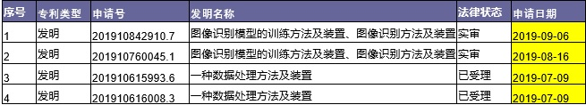

# record
记录一些成绩吧
## COCO

## 两个git图片
两张图片是解决重复注意力的一种方法，申请了专利 

可以看到base_line.gif在后面一种重复，而下面的att_new.gif则没有这种情况。

## 很早之前的一篇专利
[指向专利位置](https://zhuanli.tianyancha.com/6c7b526ef893cfa88100bd930804cbb7)

